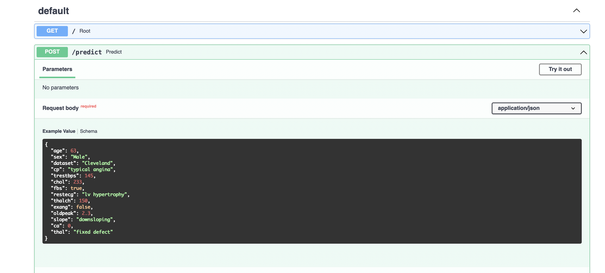

## important notes

1. there is a trained model provided in this git repository (models/classifier_pipeline.pkl) to make testing easy
2. training model requires having Poetry in general environment setup (i.e. model training is not containerised for the sake of time saving)
3. building and testing API requires Docker only
4. `/predict` endpoint does minimal job for data validation. all features are required. server will through error if feature value is invalid

---

## Local dev setup

Install Poetry [link](https://python-poetry.org/docs/#installation)

Project has minimal requirements of Python 3.10 and Poetry 1.2.0

```bash
poetry shell
```

### Training

Training can be done by executing notebook in `notebooks/clsf.ipynb`

### Running dev server

You can server run locally
```bash
MODEL_PATH=models/classifier_pipeline.pkl uvicorn app.main:app --reload
```

Server will be running on `http://127.0.0.1:8000`

### Testing endpoint

Api documentation located on: [http://127.0.0.1:8000/docs](http://127.0.0.1:8000/docs)

Predict endpoint is prepopulated with example data:



Example curl

```bash
curl -X 'POST' \
  'http://127.0.0.1:8000/predict' \
  -H 'accept: application/json' \
  -H 'Content-Type: application/json' \
  -d '{
  "age": 63,
  "sex": "Male",
  "dataset": "Cleveland",
  "cp": "typical angina",
  "trestbps": 145,
  "chol": 233,
  "fbs": true,
  "restecg": "lv hypertrophy",
  "thalch": 150,
  "exang": false,
  "oldpeak": 2.3,
  "slope": "downsloping",
  "ca": 0,
  "thal": "fixed defect"
}'
```

response example:
```json
{"pred":0,"probability":0.6181561645416247}
```

## Building docker image

```bash
docker build -t otus-hw/pycls:0.1.0 .
```

## Running docker container

```bash
docker run -p 8000:80 \
  -e MODEL_PATH=/models/classifier_pipeline.pkl \
  -v $(pwd)/models/:/models \
  otus-hw/pycls:0.1.0
```
